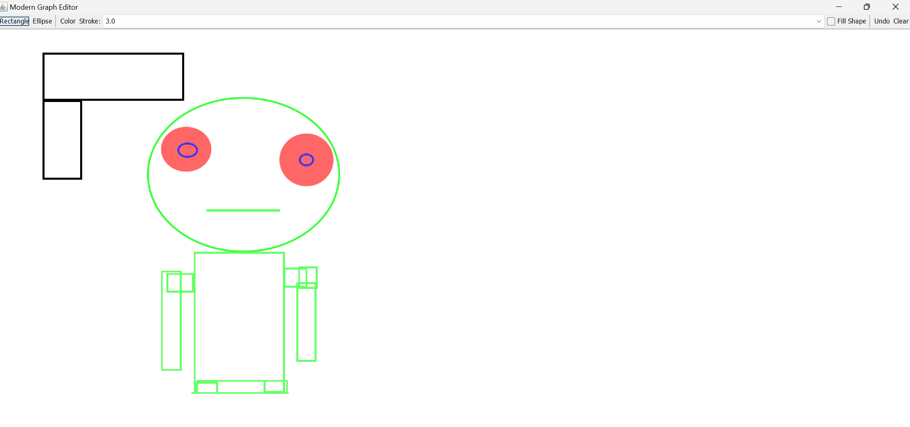

# GraphEditor

A modern, Java Swing-based vector drawing application for creating and manipulating geometric shapes.



## Overview

GraphEditor is a lightweight yet powerful desktop application that allows users to create, edit, and manage vector graphics. Built with Java Swing, it provides an intuitive interface for drawing geometric shapes with customizable properties.

## Features

- **Multiple Shape Types:** Create rectangles and ellipses (easily extendable to more shapes)
- **Customizable Styling:** Change colors, stroke width, and fill options
- **Interactive Drawing:** Click and drag to create shapes of any size
- **Undo Functionality:** Remove last drawn shape with a single click
- **Canvas Clearing:** Start fresh with a clear canvas option
- **Anti-aliased Rendering:** Smooth shape edges for professional results
- **Modern UI:** Clean interface with toolbar and status bar
- **System Look and Feel:** Matches your operating system's visual style

## Requirements

- Java Runtime Environment (JRE) 8 or higher
- Minimum screen resolution of 800x600

## Installation

1. Clone this repository or download the source code:
   ```bash
   git clone https://github.com/yourusername/grapheditor.git
   ```

2. Compile the source code:
   ```bash
   javac GraphEditor.java
   ```

3. Run the application:
   ```bash
   java GraphEditor
   ```

## Usage Guide

### Drawing Shapes

1. Select a shape type (Rectangle or Ellipse) from the toolbar
2. Click and hold on the canvas where you want to start drawing
3. Drag to resize the shape
4. Release to finalize the shape

### Customizing Shapes

- Click the "Color" button to select a drawing color
- Adjust the stroke width using the dropdown selector
- Check "Fill Shape" to create filled shapes instead of outlines

### Editing Operations

- Click "Undo" to remove the most recently added shape
- Click "Clear" to remove all shapes and start fresh

## Architecture

GraphEditor follows an object-oriented design with the following key components:

- **GraphEditor**: The main application class that sets up the UI and coordinates between components
- **DrawingCanvas**: Custom JPanel for rendering shapes and handling painting operations
- **DrawnShape**: Data class that encapsulates shape properties (geometry, color, stroke, fill)
- **Mouse Listeners**: Handle user interactions for creating and modifying shapes

## Extending the Application

To add new shape types:
1. Create a new button in the `createToolBar()` method
2. Add a new shape type to the `createShape()` method
3. Implement any specific drawing behavior in the `DrawingCanvas` class

## License

This project is licensed under the MIT License - see the LICENSE file for details.

## Contributing

Contributions are welcome! Please feel free to submit a Pull Request.

1. Fork the repository
2. Create your feature branch (`git checkout -b feature/amazing-feature`)
3. Commit your changes (`git commit -m 'Add some amazing feature'`)
4. Push to the branch (`git push origin feature/amazing-feature`)
5. Open a Pull Request

## Acknowledgments

- Inspired by classic vector drawing applications
- Built with Java Swing for cross-platform compatibility
